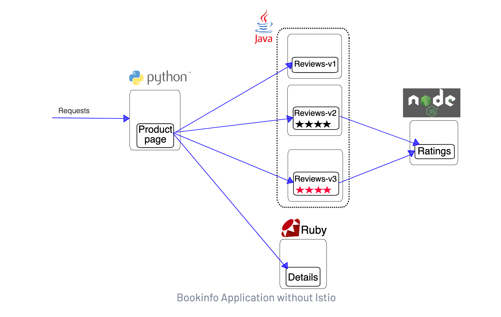

# Istio with Kubernetes Gateway API on K3D

## Prerequisites

This guide sets up Istio with Kubernetes Gateway API on K3D cluster running on Docker.

## Installation Steps

### 1. Install Istio Base Chart

```bash
helm repo add istio https://istio-release.storage.googleapis.com/charts
helm repo update

# The base chart contains the basic CRDs and cluster roles required to set up Istio
helm search repo istio/base --versions -l | more

helm install istio-base istio/base \
--version 1.26.2 \
-n istio-system \
--create-namespace \
--wait
```

### 2. Install Istio Control Plane (istiod)

```bash
# istiod is the CONTROL PLANE component that manages and configures the proxies to route traffic within the mesh
helm search repo istio/istiod --versions -l | more

helm install istiod istio/istiod \
--version 1.26.2 \
--namespace istio-system \
--wait
```

### 3. Install Kubernetes Gateway API CRDs

```bash
# The Kubernetes Gateway API CRDs do not come installed by default on most Kubernetes clusters
kubectl get crd gateways.gateway.networking.k8s.io 

kubectl apply -f https://github.com/kubernetes-sigs/gateway-api/releases/download/v1.0.0/standard-install.yaml
```

### 4. Install MetalLB for LoadBalancer Services

```bash
# Install MetalLB to create "LoadBalancer" services on K3D. This is required for Kubernetes Gateway
helm repo add metallb https://metallb.github.io/metallb

helm install my-metallb metallb/metallb \
--version 0.15.2 \
--namespace metallb-system \
--create-namespace
```

### 5. Configure MetalLB IP Pool

```bash
cat <<EOF | kubectl apply -f -
apiVersion: metallb.io/v1beta1
kind: IPAddressPool
metadata:
  name: default-pool
  namespace: metallb-system
spec:
  addresses:
  - 172.19.255.200-172.19.255.250
EOF

cat <<EOF | kubectl apply -f -
apiVersion: metallb.io/v1beta1
kind: L2Advertisement
metadata:
  name: default-advertise
  namespace: metallb-system
spec:
  ipAddressPools:
  - default-pool
EOF
```

## Deploying Test Application (Bookinfo)



This application is polyglot, i.e., the microservices are written in different languages. It’s worth noting that these services have no dependencies on Istio, but make an interesting service mesh example, particularly because of the multitude of services, languages and versions for the reviews service.

### 1. Create Namespace and Enable Istio Injection

```bash
kubectl create ns istio-demo
kubectl label namespace istio-demo istio-injection=enabled
```

### 2. Deploy Bookinfo Application

```bash
# Source: https://raw.githubusercontent.com/istio/istio/release-1.26/samples/bookinfo/platform/kube/bookinfo.yaml
kubectl apply -n istio-demo -f bookinfo.yaml
```

### 3. Verify Application is Running

```bash
# Verify that the application is running from within the namespace
kubectl exec -n istio-demo "$(kubectl get pod -n istio-demo -l app=ratings -o jsonpath='{.items[0].metadata.name}')" -c ratings -- curl -sS productpage:9080/productpage | grep -o "<title>.*</title>"
```

### 4. Expose Application using Kubernetes Gateway

```bash
# Source: https://raw.githubusercontent.com/istio/istio/refs/heads/master/samples/bookinfo/gateway-api/bookinfo-gateway.yaml
kubectl apply -n istio-demo -f bookinfo-gateway.yaml

# Wait for the gateway to be ready
kubectl -n istio-demo get gtw bookinfo-gateway
```

Expected output:
```
NAME               CLASS   ADDRESS          PROGRAMMED   AGE
bookinfo-gateway   istio   172.19.255.201   True         4m10s
```

### 5. Check LoadBalancer Service

```bash
kubectl get svc -n istio-demo
```

Expected output:
```
NAME                     TYPE           CLUSTER-IP      EXTERNAL-IP      PORT(S)                        AGE
bookinfo-gateway-istio   LoadBalancer   10.43.180.106   172.19.255.201   15021:30181/TCP,80:31398/TCP   11m
details                  ClusterIP      10.43.10.166    <none>           9080/TCP                       10m
ratings                  ClusterIP      10.43.235.136   <none>           9080/TCP                       10m
reviews                  ClusterIP      10.43.105.134   <none>           9080/TCP                       10m
productpage              ClusterIP      10.43.230.95    <none>           9080/TCP                       10m
```

### 6. Access the Application

```bash
# Create a port forward to the bookinfo-gateway-istio LoadBalancer
kubectl port-forward -n istio-demo svc/bookinfo-gateway-istio 8080:80

# Access the application from outside the cluster
curl http://localhost:8080/productpage -v

# Or open in browser: http://localhost:8080/productpage
```

## Troubleshooting

### Common Issues

**Issue 1: TLS Certificate Error**
```
upstream connect error or disconnect/reset before headers. retried and the latest reset reason: 
remote connection failure, transport failure reason: TLS_error:|268435581:SSL routines:OPENSSL_internal:CERTIFICATE_VERIFY_FAILED:TLS_error_end
```
**Solution:** Delete and recreate the Pods

**Issue 2: Service Unavailable Error**
```
HTTP/1.1 503 Service Unavailable
server: envoy
upstream connect error or disconnect/reset before headers. reset reason: connection termination
```
**Solution:** Delete everything and reinstall from scratch

## Testing Istio Features

### Prepare for Feature Testing
Before you can use Istio to control the Bookinfo version routing, you need to define the available versions

```bash
# Source: https://raw.githubusercontent.com/istio/istio/refs/heads/master/samples/bookinfo/platform/kube/bookinfo-versions.yaml
kubectl apply -n istio-demo -f bookinfo-versions.yaml
```

## Feature 1: Request Routing

### About This Feature
The Istio Bookinfo sample consists of four separate microservices, each with multiple versions. Three different versions of the `reviews` microservice have been deployed and are running concurrently. 

Without explicit routing rules, Istio routes requests to all available versions in a round-robin fashion. This feature demonstrates how to route all traffic to a specific version.

### Route All Traffic to reviews:v1

```bash
# Source: https://raw.githubusercontent.com/istio/istio/refs/heads/master/samples/bookinfo/gateway-api/route-reviews-v1.yaml
kubectl apply -n istio-demo -f route-reviews-v1.yaml
```

**Result:** The HTTPRoute tells Istio to forward all traffic destined to the "reviews" service to the "reviews-v1" service. Refreshing `/productpage` will always show reviews without star ratings.

### Feature 1a: Route Based on User Identity (Header)

Route all traffic from user "Vijay" to `reviews:v2` (which includes star ratings):

```bash
kubectl apply -n istio-demo -f route-reviews-v2.yaml
```

**Testing:**
1. On `/productpage`, log in as user `vijay` (use any password)
2. Refresh the browser - you'll see star ratings
3. Log in as another user - stars disappear (traffic goes to `reviews:v1`)

### Feature 1 Summary
- Used Istio to send 100% of traffic to v1 version of Bookinfo services
- Set selective routing to v2 based on custom `end-user` header

## Feature 2: Traffic Shifting

### About This Feature
Demonstrates gradual traffic migration from an older version to a new one using weighted routing.

### Step 1: Split Traffic 50/50 Between v1 and v3

```bash
kubectl apply -n istio-demo -f route-reviews-50-v3.yaml
```

**Result:** Refresh `/productpage` and see red star ratings approximately 50% of the time (v3 shows red stars, v1 shows no stars).

### Step 2: Route 100% Traffic to v3

```bash
kubectl apply -n istio-demo -f route-reviews-v3.yaml
```

**Result:** Refresh `/productpage` multiple times - you'll always see red star ratings.

### Feature 2 Summary
- Migrated traffic from old to new version using Istio's weighted routing
- This differs from container orchestration platform deployments which use instance scaling
- With Istio, both versions can scale independently without affecting traffic distribution

## Key Benefits Demonstrated

1. **Traffic Management:** Control routing without changing application code
2. **Gradual Rollouts:** Safely migrate traffic between versions
3. **User-based Routing:** Route based on headers or other request attributes
4. **Independent Scaling:** Versions can scale without affecting traffic distribution